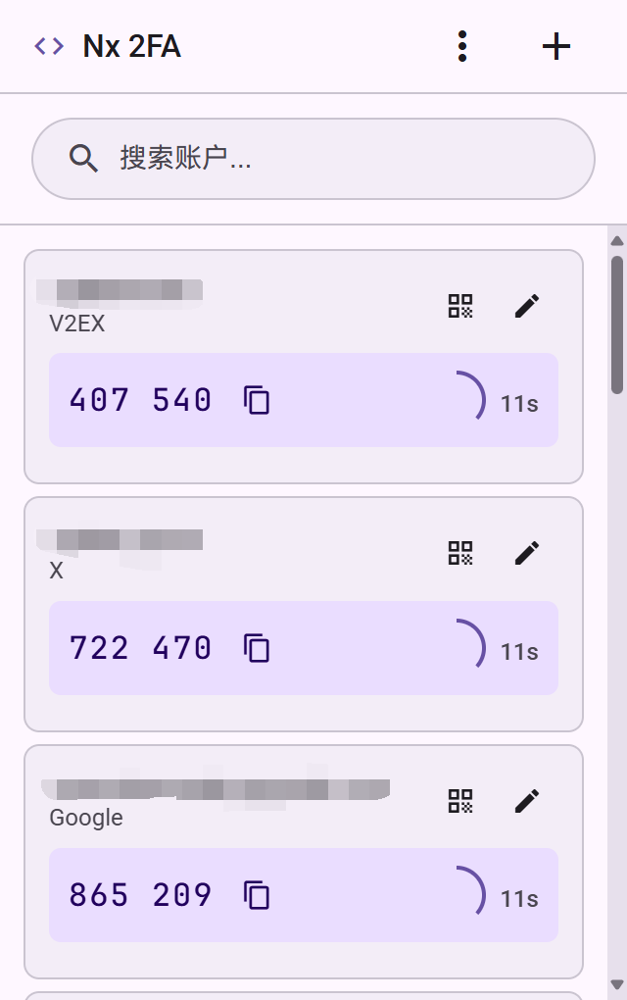

# Nx 2FA - Browser Extension for TOTP 2FA
> **注意**: 此扩展处理敏感的认证信息，请确保只从可信来源安装，并定期检查扩展权限。

浏览器扩展程序，用于管理和生成 TOTP 2FA 验证码，支持 Edge 和 Chrome 等基于 Chromium 的浏览器。

## 功能特性

- **TOTP验证码生成**: 支持标准的6位 TOTP 验证码
- **实时倒计时**: 显示验证码剩余有效时间
- **一键复制**: 点击验证码或复制按钮快速复制到剪贴板
- **智能搜索**: 实时搜索账户名称和发行商
- **智能置顶**: 自动识别并置顶与当前网页匹配的账户
- **可视化标识**: 匹配账户显示置顶标签提示
- **导入导出功能**: 支持`otpauth://`格式的备份和恢复
- **多账户管理**: 支持添加、编辑和删除多个2FA账户
- **Material Design 3**: 使用 Google Material Design 3 风格设计 UI
- **Manifest V3**: 符合最新 Chrome 扩展标准

## 预览

## 安装方法
1. 打开Chrome/Edge等基于Chromium的浏览器，访问 `chrome://extensions/`
2. 在右上角启用"开发者模式"
3. 点击"加载已解压的扩展程序"
4. 选择包含此扩展文件的文件夹
5. 扩展将出现在Chrome工具栏中

## otpauth:// URI 格式说明
标准格式: `otpauth://totp/标签?参数`
支持的参数:
- `secret`: Base32编码的密钥（必需）
- `issuer`: 发行商名称
- `period`: 时间间隔（默认30秒）
- `digits`: 验证码位数（默认6位）
- `algorithm`: 哈希算法（默认SHA1）

